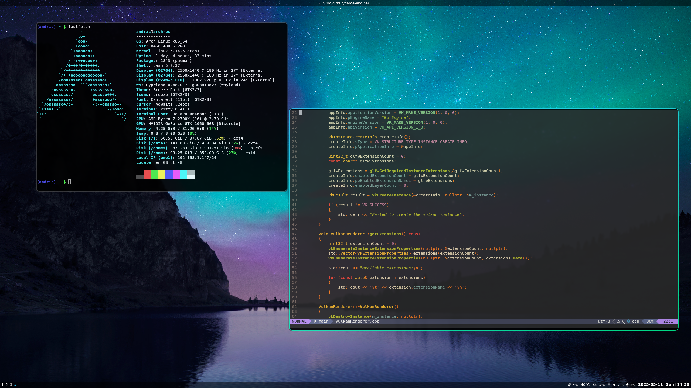

# dotfiles

## These are my configuration files I use on my system, to us it install git and stow first

``` bash
sudo pacman -S git stow hyprland hyprpaper hyprlock waybar ttf-jetbrains-mono-nerd rofi 
```

## Than clone the repo

``` bash
git clone https://github.com/andris1177/dotfiles.git
cd dotfiles
```

## Don't forget to edit the hyprland config in .config/hypr/hyprland.conf where you have to change the monitor config according to your setup which is at line 18-20, and also you have to change which workspace is tied to which monitor, that you can find from line 31 to line 41. Also change the hyprpaper config which you can find in .config/hypr/hyprpaper.conf.

### wiki for the hyprland display settings: https://wiki.hyprland.org/Configuring/Monitors/
### wiki for hyprpaper: https://wiki.hyprland.org/Hypr-Ecosystem/hyprpaper/

## And than use stow to link them to the right place

``` bash
stow .
```

## I got my wallpapers from here https://gitlab.com/dwt1/wallpapers


